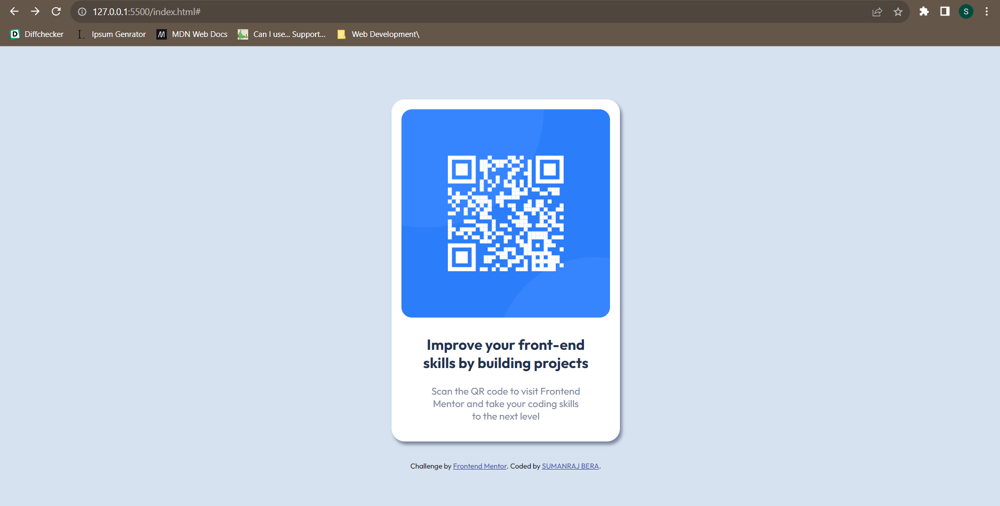

# Frontend Mentor - QR code component solution

This is a solution to the [QR code component challenge on Frontend Mentor](https://www.frontendmentor.io/challenges/qr-code-component-iux_sIO_H). Frontend Mentor challenges help you improve your coding skills by building realistic projects. 

## Table of contents

- [Overview](#overview)
  - [Screenshot](#screenshot)
  - [Links](#links)
- [My process](#my-process)
  - [Built with](#built-with)
  - [What I learned](#what-i-learned)
  - [Continued development](#continued-development)
  - [Useful resources](#useful-resources)
- [Author](#author)
- [Acknowledgments](#acknowledgments)

## Overview

This was my first time using Frontend Mentor to develop a frontent design into webpage and it was a good revision to hone my skills further.

### Screenshot

### Links

- Solution URL: [Add solution URL here](https://your-solution-url.com)
- Live Site URL: [Github Pages](https://samtheblackdragon.github.io/QR-CODE-COMPONENT-MAIN/)

## My process

- First I viewed the design
- Then I made use of (style-guide.md) to set up my css.
- Next, I found the font-family so that it can be put inside the body
- Next, I step-by-step copied the design to make the webpage.

### Built with

- Semantic HTML5 markup
- CSS custom properties
- Flexbox

### What I learned

In this section, I only recapped over my skills to revise what I have learned in the past few months of starting web development and I was able to replicate the process.

### Useful resources

- [Stack Overflow](https://stackoverflow.com/) - This helped me for making decisions about using flexbox. 

## Author

- Github - [Sumanraj Bera](https://github.com/Samtheblackdragon)
- Frontend Mentor - [@Samtheblackdragon](https://www.frontendmentor.io/profile/Samtheblackdragon)
- Instagram - [@samblack__dragon](https://www.instagram.com/samblack__dragon/)
